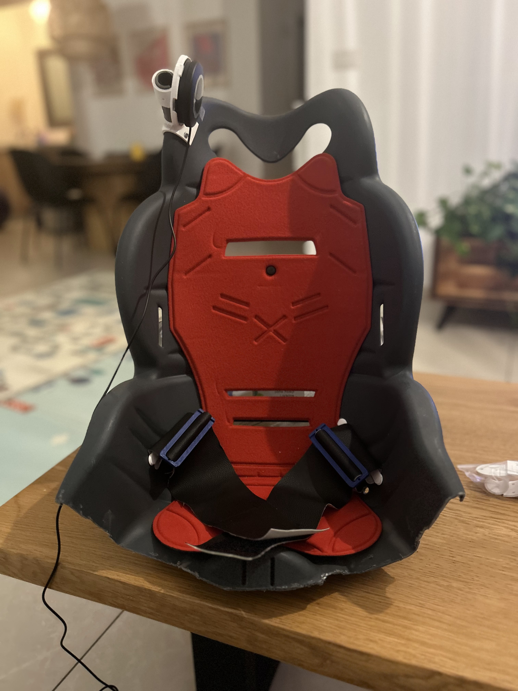

# GoBabyGo Core Build Kit

This repository contains the core set of open-source 3D-printed components developed for **GoBabyGo** — a volunteer-driven nonprofit dedicated to building adapted electric cars for children with disabilities.

🖨️ Printable model pages:
🔗 [Core Build Kit Models](https://www.printables.com/model/875079-adaptive-electric-car-core-kit-gobabygo-israel)
🔗 [Stabilized Adaptive Push Button Models](https://www.printables.com/model/993443-stabilized-adaptive-switch-go-baby-go-il/files)

📘 Learn more in our blog post:
🔗 [Core Build Kit Overview](https://medium.com/@mikeystrauss/adapting-cars-for-children-with-disabilities-the-gobabygo-core-build-kit-08175c2a7b7c)

Maintainers:
* Mikey Strauss - GoBabyGo Israel - `mdstrauss91@gmail.com`
* Christaphor - 
* Barbara 

### Empowering Mobility Through Open, Accessible Design

At **GoBabyGo**, we believe every child deserves the freedom to move, explore, and experience independence. The **Core Build Kit** is our open-source effort to share the core components and lessons from years of building customized electric cars for children with disabilities.

This kit reflects over a decade of iterative learning, hands-on problem-solving, and feedback from hundreds of families and builders. Our mission is to make adaptive ride-on vehicles simpler, more consistent, and easier for other GoBabyGo chapters, makers, and caregivers to replicate and customize.

> 💡 The kit is built for collaboration. Whether you're improving it for your local chapter or adapting it to new use cases, we welcome your ideas and contributions.

---

### What's Inside the Kit?

#### 🔘 **Push Button Adaptation**

We replace foot pedals with accessible hand- or head-activated push buttons. The kit includes:

* A no-solder generic **pedal-to-jack adapter**
* Modular **push button mounts** for off-the-shelf (e.g., Logitech Adaptive Kit) and custom buttons
* Stable, flexible **mounting connectors** for various control schemes
* Mods and Extentions models for different use cases.

<!-- 

 -->

| Test | Test |
| --- | --- |
| |  |
| |  |

#### 🪑 **Seating Customization**

Standard seat belts rarely meet the needs of children with disabilities. Our approach:

* Wide, adjustable belts with printed mounts and tri-glide adjusters
* Low-profile mounts for use with adaptive bike seats and close-fitting car frames

#### 🧩 **Modular PVC Mounts**

* Headrests
* Lap boards
* External support structures

> Currently supporting 20mm PVC parts for building lightweight but sturdy.

### 🧠 Stabilized Adaptive Push Button (v1 – Prototype)

A robust, customizable switch (65mm) designed for adaptive electric cars, toys, and gaming environments. It offers enhanced stability, tactile feedback, and compatibility with common low-profile mechanical keyboard switches.

#### Key Features:

* **X/Y Stabilization** — Reduces wobble, improves actuation consistency
* **Swappable Springs** — Adjustable actuation force for different users
* **Snap-In Mounting** — Supports common low-profile switches (Gateron, Kailh)
* **Child-Friendly** — Durable with engaging tactile response
* **Logitech Gaming Kit Compatible** — Includes mounts for Logitech large buttons
* **JellyBean-Style Cap** — Transforms switch into a classic accessible form

> 📄 For detailed [information](./docs/stabilized_round.md) and 3D model files of the stabilized push button.

---

### Materials and Printing Recommendations

All printed parts are designed with accessibility and ease-of-use in mind. We recommend:

* **PETG** filament for safety and durability
* 0.35 mm layer height for most parts, 0.2 mm for fine details.
* Mounts designed for M3 screws or zip-tie options

---

### Why This Kit?

Crafted by the Israeli chapter of GoBabyGo —  Over the course of building \~800 adapted vehicles, we realized the value of **consistency**, **modularity**, and **collaboration**. The Core Build Kit simplifies complex adaptations without sacrificing the flexibility needed for each unique child. Our long-term vision is to see this kit evolve as a community tool—shared, improved, and loved by chapters and makers worldwide.

---

### Start Collaborating

Learn more about **GoBabyGo Core build kit** and our ongoing projects:

Submit issues, ideas, or improvements via this GitHub repo.
Join our informal WhatsApp group for builders and volunteers — request access via Facebook or LinkedIn.

🌐 [Website](https://www.gobabygo.org.il/english-1)
📘 [Facebook](https://www.facebook.com/gobabygoil/)
💼 [LinkedIn](https://www.linkedin.com/in/mikey-strauss-a4312999/)

> Need help building or printing parts? Reach out — we have parts in stock and are happy to support new builders.
